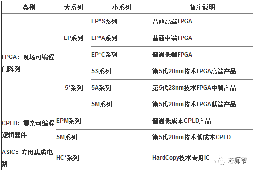

# [FPGA](https://github.com/mcuyun/FPGA) 

#### [关于悠云](https://github.com/mcuyun/whyme)可访问 www.mcuyun.com

FPGA（Field－Programmable Gate Array），即现场可编程门阵列，属于硬件编程，在多功能性和能力方面FPGA介于微控制器(MCUs)和ASICs之间，FPGA对程序的灵活性更差，FPGA可以执行大量低延迟的计算，MCUs在开发中更容易使用。

FPGA的核心优点：可编程灵活性高、开发周期短、并行计算可编程灵活性高。未来，如果FPGA价格到低一定程度，将替代大多数的ASIC芯片。但是，目前制约FPGA发展的三大因素主要有：成本、功耗和编程设计。

FPGA的设计需要硬件描述语言(HDL)。尽管C程序是一个连续的指令序列，并且必须与自身相适应以实现并行执行，但是HDL描述了一个并发的电路，并且必须与它相适应以实现连续执行。

FPGA的重点是并行执行。有时，你需要担心你的MCU的ISR需要多长时间来服务中断，以及你是否能够实现你的硬实时限制。然而，在FPGA中有许多有限状态机(FSM)一直在运行。

FPGA市场四大巨头：Xilinx（赛灵思）、Altera（阿尔特拉）、Lattice（莱迪思）、Microsemi(美高森美)

---

###  [悠云，为嵌入式](http://www.mcuyun.com)   
###  qitas@qitas.cn
